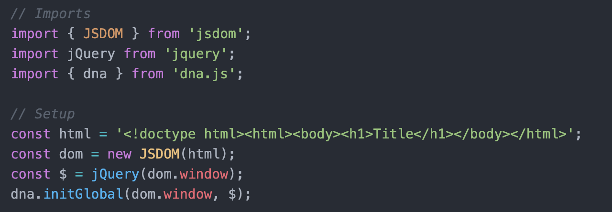

# dnajs-node-jsdom-starter


_Sample dna.js application running on node with jsdom_

[](https://dnajs.org/license)
[](https://snyk.io/test/github/dnajs/dnajs-node-jsdom-starter)
[](https://travis-ci.org/dnajs/dnajs-node-jsdom-starter)

[dnajs.org](https://dnajs.org), a UI library for jQuery, can be run headless (no browser) on
Node.js with the DOM provided by jsdom.

### Setup
Execute `run-app.sh.command` or enter the terminal commands:
```
$ cd dnajs-node-jsdom-starter
$ npm install
$ node app.js
```

### Import


### Output


---
[MIT License](LICENSE.txt)
