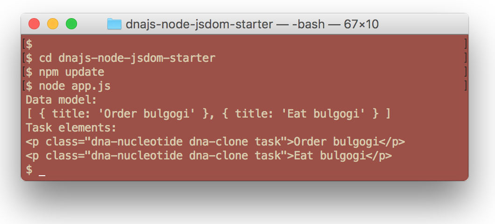

# node-jsdom-starter


_Sample dna-engine application running on node with jsdom_

[](https://dna-engine.org/license)
[](https://github.com/dna-engine/node-jsdom-starter/actions/workflows/run-spec-on-push.yaml)

[dna-engine.org](https://dna-engine.org), a UI templating library, can be run headless (no browser) on
Node.js with the DOM provided by jsdom.

### Setup
Enter the terminal commands:
```shell
$ cd node-jsdom-starter
$ npm install
$ node app
```

### Import and Initialize
```javascript
// Imports
import { JSDOM } from 'jsdom';
import { dna } from 'dna-engine';

// Setup
const html = `
   <!doctype html>
   <html lang=en>
      <head>
         <meta charset=utf-8>
         <title>Tasks</title>
      </head>
      <body>
         <p id=task class=dna-template>~~title~~</p>
      </body>
   </html>
   `;
const dom = new JSDOM(html);
dna.initGlobal(dom.window);
```

### Output


---
[MIT License](LICENSE.txt)
