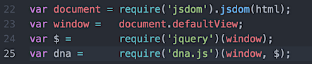

### dnajs-node-jsdom-starter

*Sample dna.js application running on node with jsdom*

---


[dnajs.org](http://dnajs.org), a UI library for jQuery, can be run headless (no browser) on
Node.js with the DOM provided by jsdom.

### Setup
Execute `run-app.sh.command` or enter the terminal commands:
```
$ cd dnajs-node-jsdom-starter
$ npm update
$ node app.js
```

### require()


### Output


---
[MIT License](LICENSE.txt)
